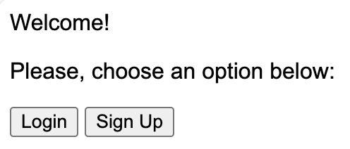
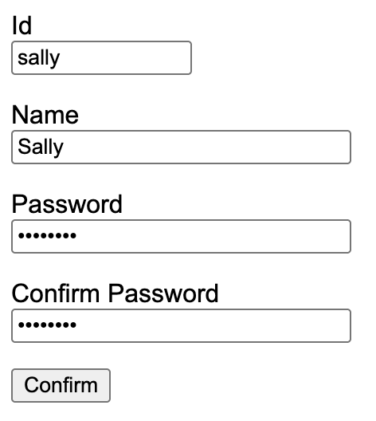
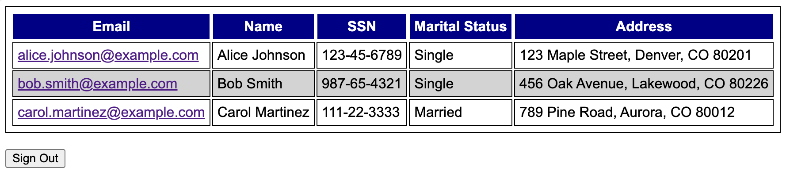
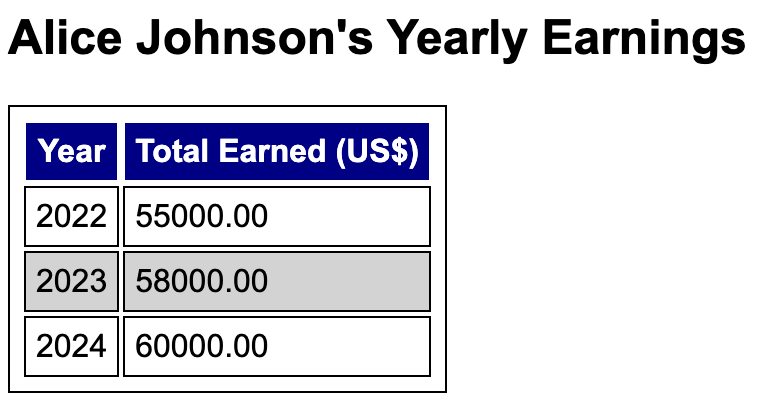

# Overview

In this assignment you will perform a structured internal security test and audit on a provided web application to demonstrate how it has been vulnerable to systematic external attacks, particularly SQL injection. You will enable MySQL logging, simulate attacks, analyze logs, and produce comprehensive security reports with recommendations. 

# Disclaimer 

The code and instructions provided are intended solely for educational purposes. They are designed to help learners understand security concepts and practices in a controlled, academic environment.

Do not use this code or any related techniques to perform penetration testing or security assessments on production systems, live environments, or systems under active development without proper authorization.

The instructor and course facilitators are not responsible for any misuse of the materials or any consequences resulting from unauthorized testing or deployment.

# Database Setup

Refer to Homework 13 and ensure you have built a custom MySQL Docker image with both general query logging and error logging enabled. A custom [my.cnf](my.cnf) and a [Dockerfile](Dockerfile) are provided for your convenience.

Once the image is built, launch a container from it, updating the volume mappings as needed to support your logging configuration. 

Next, after reviewing the database model implemented in [taxes.sql](taxes.sql), start a MySQL shell and create the **taxes** database using the SQL statements provided in [taxes.sql](taxes.sql).

Create a view named **ClientYearlyEarnings** that generates the following output based on the initial data inserted by the SQL script.

```
+----------------------------+----------------+------+-------------+
| Email                      | Name           | Year | TotalEarned |
+----------------------------+----------------+------+-------------+
| alice.johnson@example.com  | Alice Johnson  | 2022 |    55000.00 |
| alice.johnson@example.com  | Alice Johnson  | 2023 |    58000.00 |
| alice.johnson@example.com  | Alice Johnson  | 2024 |    60000.00 |
| bob.smith@example.com      | Bob Smith      | 2022 |    72000.00 |
| bob.smith@example.com      | Bob Smith      | 2023 |    75000.00 |
| bob.smith@example.com      | Bob Smith      | 2024 |    77000.00 |
| carol.martinez@example.com | Carol Martinez | 2022 |    98000.00 |
| carol.martinez@example.com | Carol Martinez | 2023 |   102000.00 |
| carol.martinez@example.com | Carol Martinez | 2024 |   105000.00 |
+----------------------------+----------------+------+-------------+
```

# Web App Setup

Create and activate a Python virtual environment. Then, install the following Python packages: 

```
flask
flask-wtf
flask-login
mysql-connector-python
```

Those packages can be easily installed using: 

```
pip3 install -r requirements.txt
```

From the project's root directory, configure Flask's **FLASK_APP** environment variable as follows:

```
export FLASK_APP=src/app
```

Next, start your web app using: 

```
flask run
```

The app's welcome screen should then be displayed. 



Click on the **Sign Up** button and create a new user with **id='sally'** and **password='12345678'**. 



User 'sally' should be created only after confirmation. However, new users are initially added to the database without authorization to access the app. Authorization must be granted manually by the database administrator.
To authorize a newly created user to log in, use the **SQL UPDATE** statement provided in [taxes.sql](taxes.sql) and shown below: 

```
UPDATE Users
SET Authorized = TRUE
WHERE Id = 'sally';
```

After logging in as user 'sally', you should be able to view a list of all the company's clients.



Clicking on a client's name—such as 'Alice Johnson'—should prompt the app to display all of that client's earnings, organized year by year. Note: This listing will only function correctly once the **ClientYearlyEarnings** view has been successfully created, as previously requested.



# Security Testing 

In this part of the project, you will simulate an organization's internal security testing to identify vulnerabilities in the Taxes web application.
This will be conducted as a black box test, meaning it will be performed without any prior knowledge of the app's internal structure or the system it runs on. The scope of the test includes both the web application and its backend database system.

Thr security approach used will involve active reconnaissance, where direct interaction with the system is used to provoke responses to learn as much information as possible. 

## Identifying the Database 

Normally, a database system running behind a web application should be protected by firewall rules that restrict access to connections originating only from the web server. However, for the sake of simplification in this project, we assume that such protections are not in place. As a result, the security testing machine has direct access to the database system.

Run [/src/port_scanner.py] and copy and paste its output below: 

```
Copy and paste the output of port_scanner here!
```

## Bypassing User Authentication

Use security testing techniques to attempt bypassing the app's user authentication. If successful, document which user ID was used during the test. 

```
Copy and paste the user's Id used
```

## Determining the Database User 

Once authenticated, you can access a list of a client's yearly earnings by entering their email address directly into the URL. For example: **http://127.0.0.1:5000/clients/alice.johnson@example.com**. 

Use security testing techniques to attempt displaying the current database user. If successful, document the URL was used during the test. 

```
Copy and paste the URL used 
```

## Determining the Database Name 

Use security testing techniques to determine the current database. If successful, document the URL was used during the test. 

```
Copy and paste the URL used 
```

## Determing the Tables Names

Use security testing techniques to determine the table names of the database. If successful, document the URL was used during the test. Hint: in MySQL the table names of a database can be retrieved from the system's table **information_schema.tables**. 

```
Copy and paste the URL used 
```

## Determing the Structure of Each Table

Use security testing techniques to determine the structure (name of the column and its data type) of each table of the database. If successful, document the URLs was used during the test. Hint: in MySQL the structure of a table can be retrieved from the system's table **information_schema.columns**. 

```
Copy and paste the URL used to learn the structure of table Clients
```

```
Copy and paste the URL used to learn the structure of table FiscalYears
```

```
Copy and paste the URL used to learn the structure of table Earnings
```

```
Copy and paste the URL used to learn the structure of table Users
```

## Exposing User Credentials

The Users table contains two columns of particular interest from a security perspective: **Password** and **Authorized**. Apply security testing techniques to identify and display the contents of those columns per user ID. 

```
Copy and paste the URL used
```

## Cracking the Database User's Password

Use the script located at [src/password_cracker.py](src/password_cracker.py) to attempt authentication for the database user **tax_reader** using a dictionary of the 100 most common database passwords.

## Escalating Privileges

At this point, you have direct access to the database; however, the user **tax_reader** has limited privileges. Would it be reasonable to assume that, given the existence of a **tax_reader** account, there might also be a **tax_writer** user with elevated privileges?

```
Provide your answer here, along with a plausible justification to support your reasoning.
```

Assuming that there should be a **tax_writer** user, use the previous script once more but now targeting the database user **tax_writer**. 

## Security Testing Report

Report your findings after conducting the series of security tests above using a bullet-point format. Feel free to include additional tests that you consider necessary or informative for evaluating the web and database systems. 

--- 

Security Testing Report

--- 

# Security Auditing 

In this phase of the project, you will simulate an internal security audit for an organization to identify vulnerabilities in the Taxes web application. The audit will involve analyzing system logs and conducting a code review. The scope includes both the web application and its backend database system.

## MySQL General Log

The MySQL General Log is a diagnostic feature that records all SQL queries and client connections handled by the MySQL server. It's primarily used for debugging and auditing purposes.

After reviewing MySQL’s General Log, identify any activities that may indicate a potential security threat to the system.

Instructions:
* Copy and paste the specific log entries you believe are suspicious.
* Provide a brief justification for each entry, explaining why it could pose a threat to the system.

```
Write your answer here!
```

## MySQL Error Log 

The MySQL Error Log is a system log that records critical events related to the MySQL server's operation. It's primarily used for troubleshooting and monitoring server health.

Instructions: 
* Review MySQL's Error Log and identify how many "access denied" entries are associated with the database users **tax_reader** and **tax_writer**.
* Describe the method you used to automatically count these entries for each user. Be sure to mention any tools, scripts, or commands you used in the process.

```
Write your answer here!
```

## Security Code Review

A security code review is a systematic examination of source code in [src/app](src/app) with the goal of identifying and mitigating security vulnerabilities. Based on findings from the previous audit steps, examine the code in detail and highlight specific sections that pose potential security risks. Explain why each identified section is vulnerable and what kind of attack it may be susceptible to. 

--- 

Security Code Review Findings

--- 

## Security Audit Report

Summarize your findings from the security audit using a bullet-point format. For each identified threat, include:
* A brief description of the issue.
* The affected component (e.g., web application, database).
* Suggested changes or mitigations to prevent the threat in the future.

--- 

Security Audit Report

--- 

# Remediation

Based on the findings and recommendations from the security audit report, implement the necessary modifications to the affected components of the application and database system. These changes should effectively mitigate the identified security vulnerabilities and help prevent future threats.

# Submission

Update your remote repository with any of the files that were added or changed. 

# Rubric

```
+10 ClientYearlyEarnings View
+5 Security Testing: Bypassing user authentication
+5 Security Testing: DB Identification
+5 Security Testing: Table Names Identification
+10 Security Testing: Tables Structure Identification
+5 Security Testing: Exposing User Credentials
+0 Security Testing: Cracking DB User's Password 
+5 Security Testing: Escalating Privileges
+10 Security Testing: Report
+5 Security Auditing: General Log
+5 Security Auditing: Error Log
+10 Security Auditing: Code Review
+10 Security Auditing: Report
+15 Remediation
```